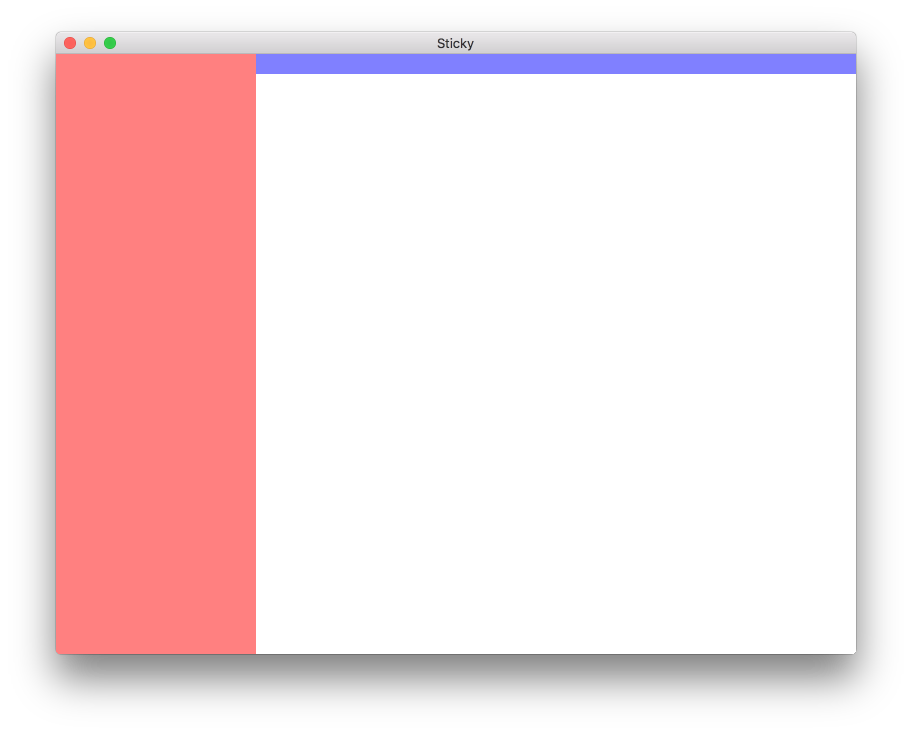
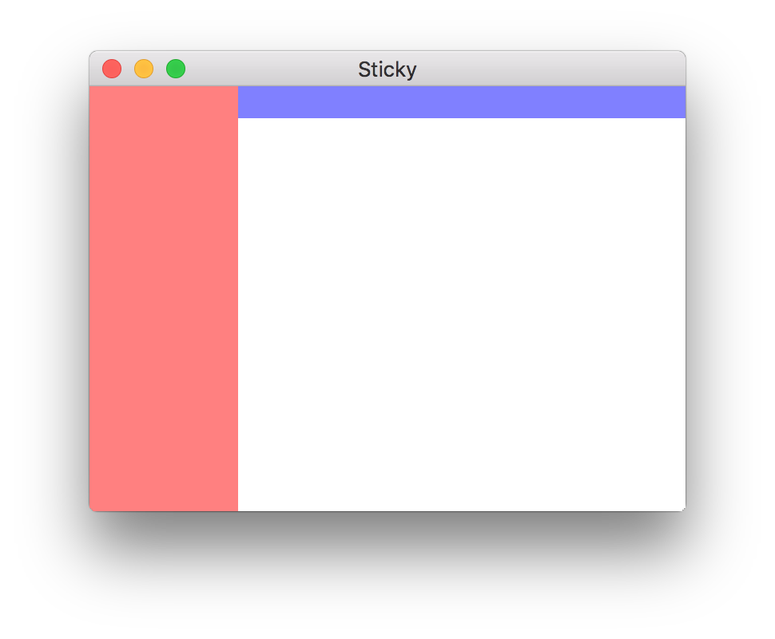
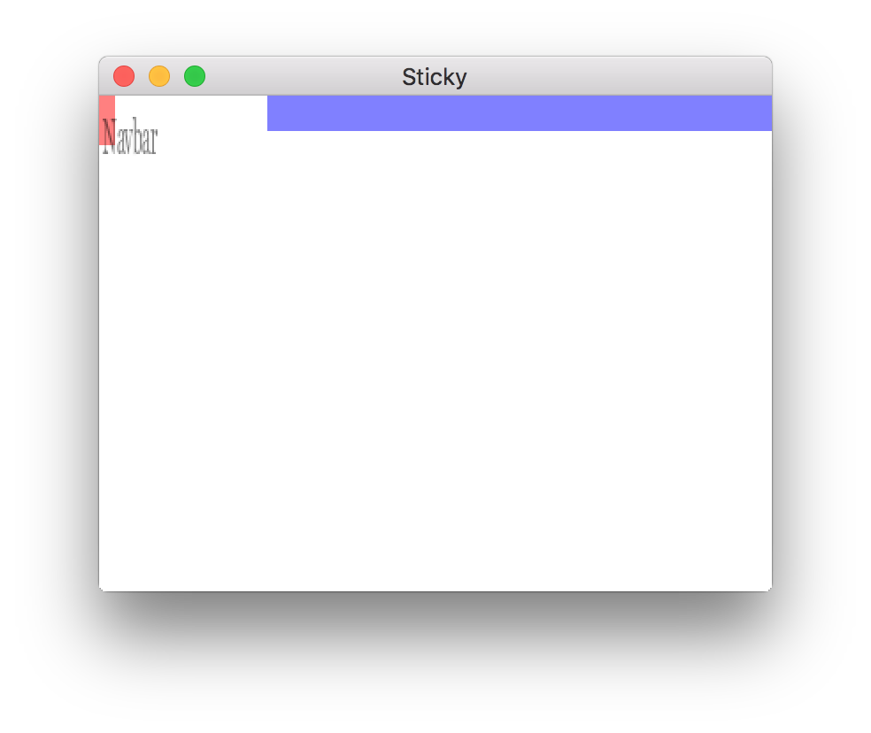

# Haxe: Window Resizing

## Scaling Content to New Size

When the window is resized, I'd like the content to also be resized.  
Following bits of this [tutorial](http://books.openfl.org/openfl-developers-guide/display-programming/working-with-display-objects/setting-stage-properties.html) I created an app that has 2 rectangles in it (a top and a left).  The left bar is always the full height of the window and 1/4 of the window width.  The top bar is always 20 pixels tall and spans the right 3/4 of the screen.

<figure>
    
    <figcaption>Initial size</figcaption>
</figure>

<figure>
    
    <figcaption>After shrinking the window</figcaption>
</figure>

`Source/Main.hx`

```haxe

```

## Scaling Without Distorting

That's all fine... until I put text or an image inside the rectangles.  Then, everything gets distorted.

<figure>
    
    <figcaption>Distorted text</figcaption>
</figure>

I imagine something like HaxeUI would fix this problem, but HaxeUI is in an unusable state at the moment.  But somehow I imagine there's a way to counteract all the scaling that's going on.


