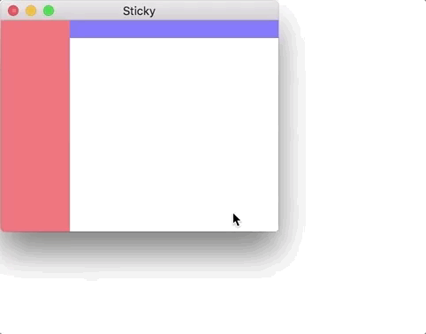

# Haxe: Black Window During Resize

## Problem

When resizing the window, it turns black (at least on macOS).

## Solution

I don't know how to fix this yet, but [it looks like it's related to using SDL2 and that it would probably have to be fixed by a change to OpenFL.](http://community.openfl.org/t/how-do-i-prevent-the-window-from-going-black-while-resizing-on-macos/10844)
